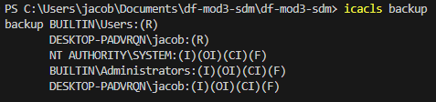

# Secure Data Management

## Commands For Files and Folders

### Using the commands mkdir, ni, move, and copy and useful commands for keeping organization in a repository. I used them to keep four folders, evidence, backup, logs, and security, and to create and copy the evidence.txt file. Organization on larger cases must be made in order to keep a workspace in order.

## Commands For File Contents

### Getting logs from a system can provide important information for an investigation. By using the command "Get-WinEvent -Listlog * > logs.txt," events are taken from the Windows event log and put in the logs.txt file. I did this for my PC and the resulting file is in the repo named logs.txt. The script windowsevents.ps1 will create a log folder and populate it with a log file containing recent windows events.

### Files can also be encrypted along with permission changes in order to keep the data secure. The script encryptdata.ps1 encrypts the evidence.txt folder in the evidence folder into a secure string. This string is stored in the security folder and permissions for Users are read-only. These commands can be very useful for a classified case where the data cannot be read from the wrong people. Encrypting the data adds an extra layer of security that prevents any reader from knowing what is in the file.

## File Permissions

### File permissions must be used to maintain security of the data. If the wrong users get writing permissions of a file, they will be able to alter the file and there could be drastic consequences. In this repo, there is a backup folder with secure data that should only be read, thus I changed the permissions for a broad group called Users in my script Copyevidence.ps1. This also prevents the backup files from being overwritten in the event of a technical error.

## Copyevidence.ps1 is a Simple Script For File Permissions

### The script will create a evidence folder along with a top secret file. The file is then duplicated and the copy is sent to a backup folder. The backup folder is then dealt with new permissions of read-only from the groups Users. We do not want our backup to be tampered with so it is important to keep this read-only. The script then gets the last five security logs and pipes them to a .csv file along with a new log exclaiming the new permission change.

### This screenshot shows the permissions for the backup file which is also saved into a text file:

## Powershell Scripting

### Scripting in powershell is a valuable skill to learn and can automate redudant processes. Copying data from an evidence folder to a backup folder and changing permissions to read-only is a process digital forensics investigators will be using all the time. Knowing how to write scripts that keeps your data secure can do wonders for the data integrity of a case.
